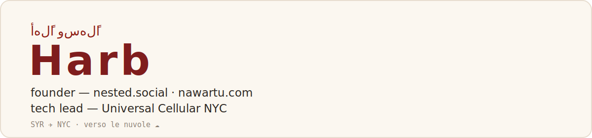

<picture>
  <source media="(prefers-color-scheme: dark)" srcset="assets/header2-dark.svg">
  
</picture>

I'm Harb — from Syria, building in New York. I ship the **whole thing**: the product, the code, the launch, and the media push that gets it in front of people.

## Building now

🪺 **[Nested](https://nested.social)** — student-only project network for NYC universities: post what you're building, find teammates, catch campus events. Live and in soft launch. React + Vite + Supabase → [nestednyc/nested-nyc](https://github.com/nestednyc/nested-nyc) · [@nestedsocial](https://instagram.com/nestedsocial)

🏮 **[Nawartu](https://nawartu.com)** — *"the easiest way to book authentic stays across the Levant."* A booking marketplace for Syria and the region: web platform, native app (Expo + Supabase), host tooling — plus the launch campaign I ran that took its media to an 8K reach and brought in the first listings. The name means *"you lit the place up."* → [@nawartuofficial](https://instagram.com/nawartuofficial)

## The day job

Tech lead at **[Universal Cellular NYC](https://universalcellularnyc.com)** — a phone wholesale & refurb operation whose internal platform I built end to end:

- **Inventory & operations automation** — from Excel/VBA ([Blueberry](https://github.com/maxgooose/Blueberry)) to Android fleet automation over ADB ([Automating-White-Collar-Work](https://github.com/maxgooose/Automating-White-Collar-Work)) to executive dashboards and an internal HR portal
- **RMA, rebuilt** — redesigned the returns pipeline around a locally-deployed AI that works the queue
- **[grading-station-mvp](https://github.com/maxgooose/grading-station-mvp)** — prototype rig for automated device cosmetic grading: sandwich-flip mechanism, cross-polarized capture, AI classification. Didn't ship — taught me hardware humility.

## Roots

🧩 **[Syrian Mosaic Foundation](https://syrianmosaicfoundation.org)** — nonprofit preserving Syrian heritage and rebuilding community. I built their site and run their media campaigns, end to end. → [@SyrianMosaicFoundation](https://instagram.com/SyrianMosaicFoundation)

## Off hours

🖐️ [hand-tracking-ar](https://github.com/maxgooose/hand-tracking-ar) — Tetris you play in the air, no controller.

✈️ 20+ countries so far — travel is half the reason Nawartu exists.

---

نوّرتوا — you lit the place up by stopping by. &nbsp;·&nbsp; <i>« verso le nuvole »</i>

